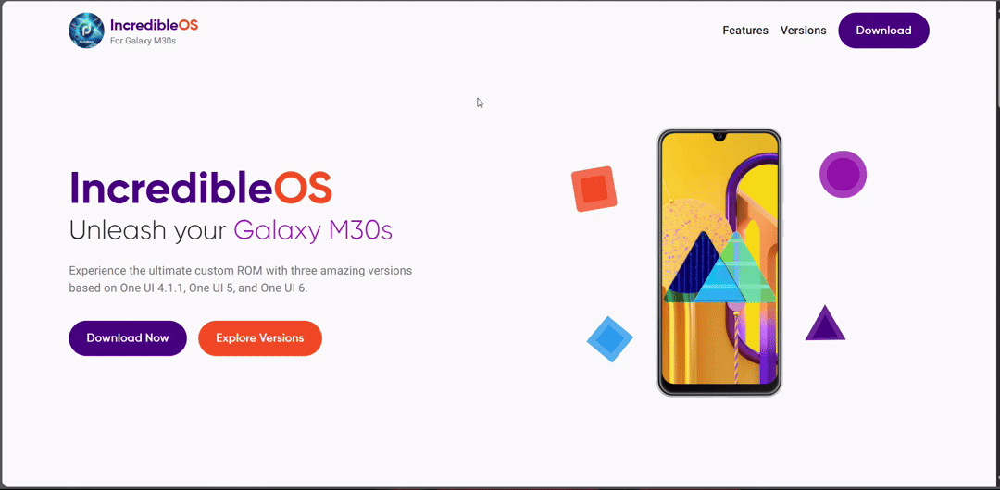

# IncredibleOS Website

Welcome to the official website for **IncredibleOS**, a custom ROM designed specifically for the **Samsung Galaxy M30s**. This website serves as a central hub for users to explore, download, and learn more about IncredibleOS and its features.

---

## 🌟 Website Preview

> *Above is a preview of the IncredibleOS website showcasing its modern design and user-friendly interface.*

---

## Purpose of the Website

The IncredibleOS website is designed to provide users with:

1. **Information about IncredibleOS**  
   Learn about the custom ROM, its features, and the different versions available. The website highlights the unique benefits of IncredibleOS, such as improved performance, battery optimizations, and deep customization options.

2. **Version Details**  
   Explore the three versions of IncredibleOS:
   - **v1**: Based on One UI 4.1.1 (Android 12)
   - **v2**: Based on One UI 5 (Android 13)
   - **v3**: Based on One UI 6 (Android 14)  
   Each version is tailored to provide a unique experience with specific features and enhancements.

3. **Download Options**  
   Easily download the ROM files for your preferred version. The website provides multiple download options, including Google Drive, Telegram, GitHub, and XDA forums, ensuring accessibility for all users.

4. **Installation Instructions**  
   Step-by-step instructions are provided to help users install IncredibleOS on their Galaxy M30s safely and efficiently.

5. **Community Links**  
   Connect with the IncredibleOS community through Telegram and XDA forums for support, updates, and discussions.

---

## 🚀 Features of the Website

- **Hero Section**: A visually appealing introduction to IncredibleOS, showcasing its purpose and key highlights.
- **Features Section**: Detailed information about the unique features of IncredibleOS, such as custom kernels, camera enhancements, and performance optimizations.
- **Versions Section**: A comparison of the three versions of IncredibleOS, helping users choose the one that best suits their needs.
- **Download Section**: A user-friendly interface to download the ROM files and access installation instructions.
- **Responsive Design**: The website is fully responsive, ensuring a seamless experience across all devices.

---

## 🛠️ Technologies Used

This website is built using modern web technologies, including:

- **React**: For building the user interface.
- **Vite**: For fast development and optimized builds.
- **Tailwind CSS**: For styling and responsive design.
- **Framer Motion**: For smooth animations and transitions.

---

## Community and Support

Join the IncredibleOS community for updates, support, and discussions:

- **Telegram**: [IncredibleOS Chat](https://t.me/incredibleOSChat)
- **XDA Forums**: [IncredibleOS Thread](https://xdaforums.com/)

---

Thank you for choosing IncredibleOS to enhance your Galaxy M30s experience!
